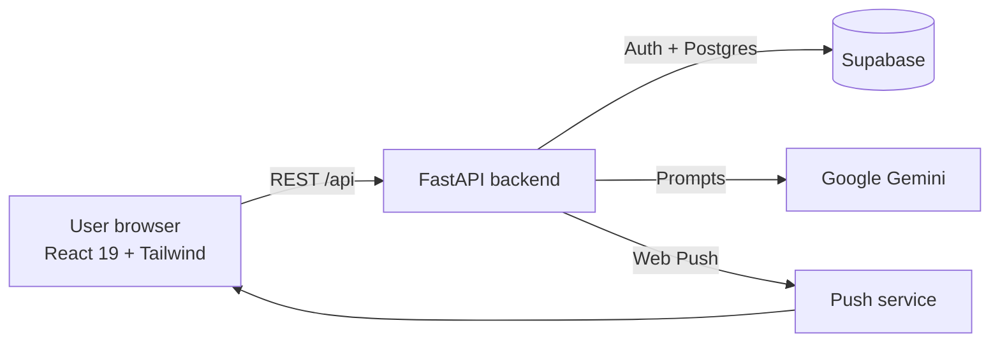

<div align="center">

# 🎯 RevealIQ Study Companion

### Study is a game you win. Focus is the currency.

A gamified study app: run focus sessions, earn coins and streaks, plan your tasks, and get AI-generated study plans and progress insights.

[](https://react.dev/)
[](https://fastapi.tiangolo.com/)
[](https://supabase.com/)
[](https://ai.google.dev/)
[](https://tailwindcss.com/)
[](LICENSE)

[](https://github.com/HarshCoder1122/focusapp/stargazers)
[](https://github.com/HarshCoder1122/focusapp/commits/main)
[](https://github.com/HarshCoder1122/focusapp/issues)

</div>

## Table of contents

- [Why](#why)
- [Features](#features)
- [How coins are earned](#how-coins-are-earned)
- [Architecture](#architecture)
- [Tech stack](#tech-stack)
- [Getting started](#getting-started)
- [Environment variables](#environment-variables)
- [API overview](#api-overview)
- [Project structure](#project-structure)
- [Deployment](#deployment)
- [Roadmap](#roadmap)
- [Contributing](#contributing)
- [License](#license)

## Why

Studying is hard to start and easy to abandon. RevealIQ turns focus time into something you can see: coins in a wallet, a streak on a calendar, badges and milestones. AI then closes the loop by turning your history into a plan.

## Features

| | |
|---|---|
| **Focus timer** | Timed sessions with attention checks. Interruptions and missed checks reduce the reward. |
| **Coins and wallet** | Longer, cleaner sessions earn more coins. A wallet page tracks the balance. |
| **Streaks** | A streak calendar rewards showing up every day. |
| **Badges and milestones** | Unlock achievements as your totals grow. |
| **Task planner** | Create, update and delete study tasks. |
| **AI study coach** | Gemini-powered daily tips, personalised study plans, and progress insights. |
| **Onboarding** | Pick your subjects and goals; edit them later from your profile. |
| **Auth** | Email and password, Google sign-in, and password reset through Supabase. |
| **Push reminders** | Web Push (VAPID) notifications for study reminders and motivation. |
| **Installable and themed** | Light and dark themes with a neon "Cyber-Scholar" look; mobile-first with session persistence. |

## How coins are earned

Rewards come from `calculate_coins` in [backend/server.py](backend/server.py).

| Session length | Base coins |
|---|---|
| 25+ minutes | 20 |
| 50+ minutes | 50 |
| 90+ minutes | 100 |

The base is scaled by your focus score, then reduced if the session was interrupted or attention checks were missed.

## Architecture



## Tech stack

| Layer | Technology |
|---|---|
| Frontend | React 19, React Router 7, Tailwind CSS, Radix UI (shadcn/ui), Framer Motion, Axios, built with CRACO |
| Backend | Python 3.11, FastAPI, Uvicorn, Pydantic |
| Data and auth | Supabase (Postgres, Auth) |
| AI | Google Generative AI (Gemini) |
| Notifications | `pywebpush` (VAPID) |
| Hosting | Render (backend, see [render.yaml](backend/render.yaml)), any static host for the frontend |

## Getting started

### Prerequisites

- Node.js 18+ and npm
- Python 3.11+
- A [Supabase](https://supabase.com/) project and a [Gemini API key](https://aistudio.google.com/app/apikey)

### 1. Clone

```bash
git clone https://github.com/HarshCoder1122/focusapp.git
cd focusapp
```

### 2. Backend

```bash
cd backend
python -m venv .venv && source .venv/bin/activate   # Windows: .venv\Scripts\activate
pip install -r requirements.txt
# create backend/.env with the variables listed below
uvicorn server:app --reload --port 8000
```

The API is now at `http://localhost:8000/api`.

### 3. Frontend

```bash
cd frontend
npm install
echo "REACT_APP_BACKEND_URL=http://localhost:8000" > .env
npm start
```

Open `http://localhost:3000`.

## Environment variables

**Backend** (`backend/.env`)

| Variable | Purpose |
|---|---|
| `SUPABASE_URL` | Your Supabase project URL |
| `SUPABASE_KEY` | Supabase anon key |
| `SUPABASE_SERVICE_KEY` | Supabase service-role key (server only; never expose it) |
| `GEMINI_API_KEY` | Google Gemini key for AI features |
| `VAPID_PUBLIC_KEY` / `VAPID_PRIVATE_KEY` | Web Push keys |
| `FRONTEND_URL` | Used for password-reset redirects (default `http://localhost:3000`) |

**Frontend** (`frontend/.env`)

| Variable | Purpose |
|---|---|
| `REACT_APP_BACKEND_URL` | Base URL of the FastAPI backend |

## API overview

All routes are prefixed with `/api`.

| Area | Endpoints |
|---|---|
| Auth | `POST /auth/register`, `/auth/login`, `/auth/logout`, `/auth/reset-password`, `/auth/google/callback`, `GET /auth/me` |
| Onboarding and profile | `POST /onboarding`, `PATCH /user/settings` |
| Study | `POST /study/session`, `GET /study/stats` |
| Streaks | `GET /streak/calendar`, `POST /streak/update` |
| Tasks | `POST /tasks`, `GET /tasks`, `PATCH /tasks/{id}`, `DELETE /tasks/{id}` |
| Rewards | `GET /wallet`, `/badges`, `/milestones` |
| AI | `POST /ai/tip`, `POST /ai/study-plan`, `GET /ai/progress-insights` |
| Notifications | `GET /notifications/vapid-key`, `POST /notifications/subscribe`, `DELETE /notifications/unsubscribe`, `POST /notifications/send-motivation` |

## Project structure

```text
focusapp/
├── backend/
│   ├── server.py          # FastAPI app and all routes
│   ├── requirements.txt
│   ├── Dockerfile
│   ├── Procfile
│   └── render.yaml        # Render deployment
├── frontend/
│   ├── src/
│   │   ├── pages/         # Landing, Auth, Onboarding, Dashboard, FocusTimer, Planner, Wallet, Profile
│   │   ├── components/    # Shared UI + shadcn/ui primitives
│   │   ├── context/       # Theme context
│   │   └── utils/         # Focus verification, study reminders
│   └── package.json
├── design_guidelines.json # Design tokens and visual language
└── tests/
```

## Deployment

- **Backend**: deploy [backend/](backend) to Render using [render.yaml](backend/render.yaml), or build the included Dockerfile. Set the environment variables above.
- **Frontend**: run `npm run build` in `frontend/` and host the `build/` folder on Vercel, Netlify or any static host. Set `REACT_APP_BACKEND_URL` to the deployed API.

## Roadmap

- [ ] Automated tests for coin calculation and streak logic
- [ ] Shared study rooms and leaderboards
- [ ] Spend coins on themes and rewards
- [ ] Offline-first PWA support

## Contributing

Contributions are welcome. Please read [CONTRIBUTING.md](CONTRIBUTING.md) and follow the [Code of Conduct](CODE_OF_CONDUCT.md). Report vulnerabilities privately as described in [SECURITY.md](SECURITY.md).

## License

Released under the [MIT License](LICENSE).

<div align="center"><sub>Built by <a href="https://github.com/HarshCoder1122">Harsh</a>. Focus is the currency.</sub></div>
